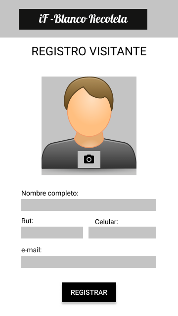
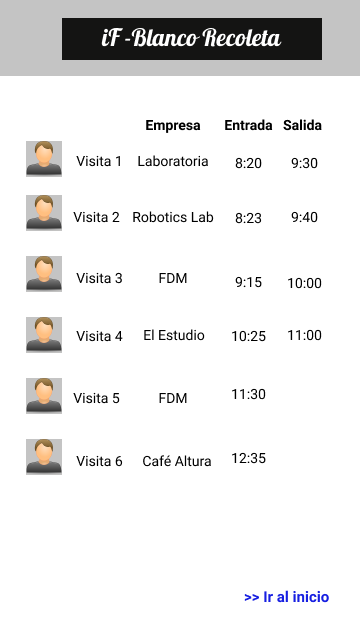

# iF - Blanco Recoleta

## Definición del producto
Nuestra aplicación es una plataforma de registro de visitas, la cual será implementada en el espacio colaborativo IF Blanco Recoleta. 

Debido a que este recinto es un espacio compartido por un grupo de empresas, las cuales están en constante recibimiento de público, por temas de seguridad se necesita tener un registro rápido y eficiente donde se puedan ingresar y ver los datos de las visitas, como la hora de su llegada y hora de salida.

El objetivo principal de esta aplicación es facilitar el registro de visitas, tanto para las personas que trabajan en el recinto, como para aquellas personas que ingresan y vienen a visitar las instalaciones. 

## UX Design

### Definición de usuario
Los principales usuarios de esta plataforma serán tanto los encargados de la recepción de las visitas que se encuentran en la entrada del establecimiento,como también las visitas que deseen ingresar a las distintas empresas presentes en el iF. 
Para tomar las decisiones sobre el diseño de interfaz de usuario, nos basamos en las entrevistas a diferentes usuarios del espacio iF Blanco Recoleta, como lo son la recepcionista, la administradora y un trabajador de una de las empresas presentes en el iF (ver audios de entrevistas en la carpeta ux-design/entrevistas-a-usuarios), y para la funcionalidad se tomó como ejemplo la página de https://envoy.com/ que es un servicio que ofrece un sistema digital de registro de visitantes.

### Prototipo de alta fidelidad

La interfaz de usuario fue diseñada con el programa Figma, se eligieron los colores en escala de grises ya que son los colores que caracterizan al logo y la página web del recinto
(link del prototipo clickeable https://www.figma.com/proto/XBwXJVdp4U5aMN421VbtOATb/Untitled?node-id=9%3A0&scaling=scale-down).

#### Página de inicio
Presenta una imágen de fondo del establecimiento y un botón en el cual se van a ingresar las visitas.

### Página de bienvenida
Se le dará la bienvenida a la visita y se le preguntará a qué empresa quiere visitar.

### Página de registro
Se hará ingreso de la visita a través de una foto que tomará la cámara del dispositivo, además de un formulario donde deberá ingresar sus datos personales y de contacto.
Aparte habrá un botón para volver hacia atrás, en caso de que la pesona haya ingresado mal la empresa.

### Listado de visitantes
Luego de darle click al botón registrar aparecerá un listado con las visitas (nombre, empresa, hora de entrada y hora de salida).
Aparte habrá un botón para volver a la página de bienvenida.

